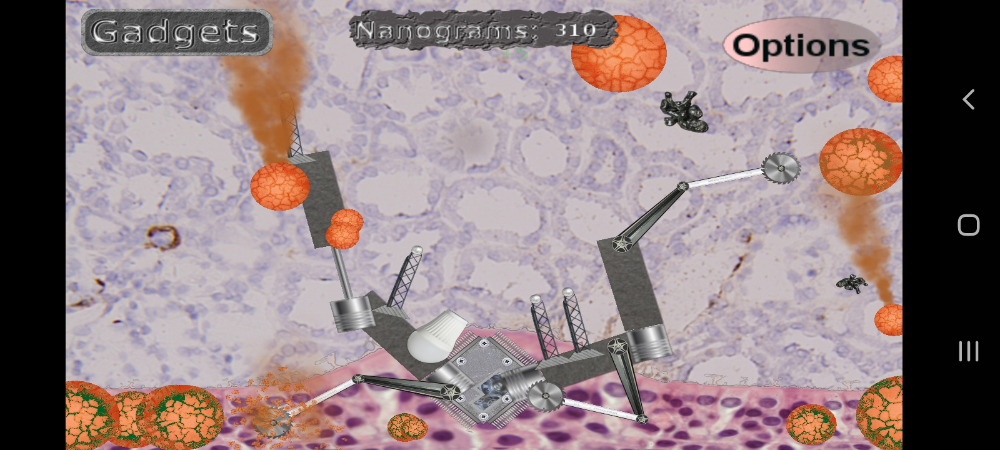
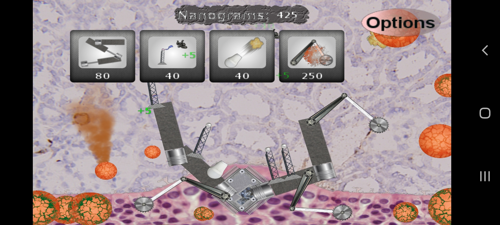

# Repo Architecture

Infection is a tower defense strategy game written in Java for Android. The repo architecture is an Eclipse Workspace, built from several different Eclipse projects which serve as dependencies for the main Eclipse project, and which can exist as standalone libraries:

- AndroidApp and App: custom implementation of Mario Zechner's game programming framework
- InfectionTowerDefenseGame: contains main code for the game including AI-related code
- Kinematics: library built specifically for this game to implement kinematic models for the in-game physics
- ModelEditor: GUI editor program to create kinematic model files
- Utilities: Personalized utility functions involving strings and arrays
- InfectionTowerDefenseGame.apk: a ready-to-use apk which can be downloaded and opened to install the game on Android

Note that this project was originally developed with Google's Eclipse extension, and needs to be updated for Google's replacement development tool, Android Studio.

## Gameplay

You control and assemble nanomachines to defend against infected cells within the human body:

## Gadget Selection

## Gadget Placement

